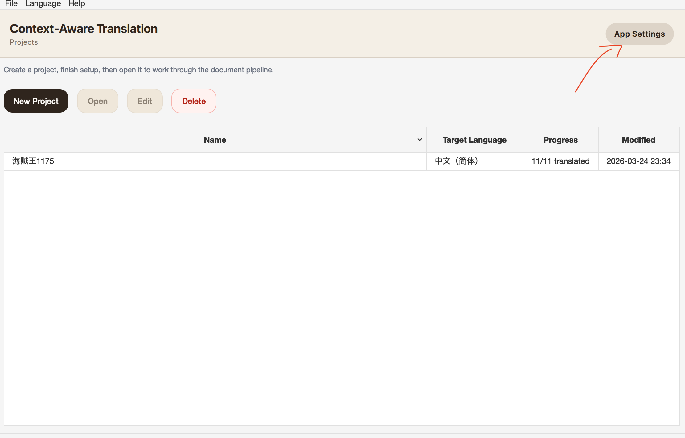
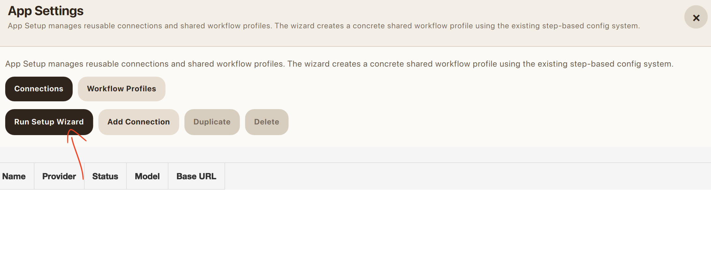

**English** | [中文](README_ZH.md)

# Context-Aware Translation (CAT)

CAT is a desktop app for translating long novels, books, PDFs, scanned documents, and manga while keeping names, terms, and context consistent.

## Who CAT Is For

- Novel, web novel, and light novel translation
- Long books and documents that need consistent naming and terminology
- Scanned books, PDFs, and manga that need OCR before translation
- People who want a desktop workflow instead of managing prompts by hand

## Why CAT

- Builds a glossary from your source material
- Carries context forward across chapters and pages
- Lets you review OCR and terms before export
- Handles text, EPUB, PDF, scanned pages, and manga in one app

## Install

### macOS

- Download the latest `.dmg`
- Open it and drag `CAT-UI.app` into `Applications`
- Launch `CAT-UI.app` from `Applications`

### Windows

- Download the latest `.zip`
- Unzip it anywhere
- Run `CAT-UI.exe`

### Build Locally (Optional)

- macOS: `make build-macos-app`
- Other platforms: `make build-ui`

## Quick Start

1. Open CAT, go to App Settings, and run the Setup Wizard.
2. Choose `Gemini` and `DeepSeek`, paste your API keys, choose the target language, and save the recommended profile.
3. Import files in reading order.
4. Run OCR first for PDFs, image folders, and manga.
5. Translate.
6. If you want translated text written back into manga or images, run image reembedding before export.
7. Export.

For most users, the default setup wizard profile should just work.

## Setup Screenshots

### 1. Open App Settings and start setup

### 2. Choose providers and paste API keys

### 3. Finish the wizard and save the recommended profile

## What To Know Before Using CAT

- The setup wizard is currently tested mainly with `DeepSeek` + `Gemini`.
- Other providers and models may work, but I do not have access to most of them, so they are not tested here. Expect to configure connections manually and tune settings yourself.
- Image reembedding / image editing can get expensive quickly.
- Manga export only writes translated text back into page images after image reembedding.
- OCR is best-effort, especially on dense or messy layouts. Review before export.
- Import in reading order if you want the glossary and context to build correctly.
- CAT is still under active development, so expect rough edges.

## Supported Formats

| Type | Import | Export | OCR needed before translation? |
| --- | --- | --- | --- |
| Text | `.txt`, `.md` | `txt` | No |
| PDF | `.pdf` | `epub`, `md` | Yes |
| Scanned book | image files or folders | `epub`, `md` | Yes |
| Manga | `.cbz`, image folders | `cbz` | Yes |
| EPUB | `.epub` | `epub`, `md`, `docx`, `html` | No, but image OCR is supported |
