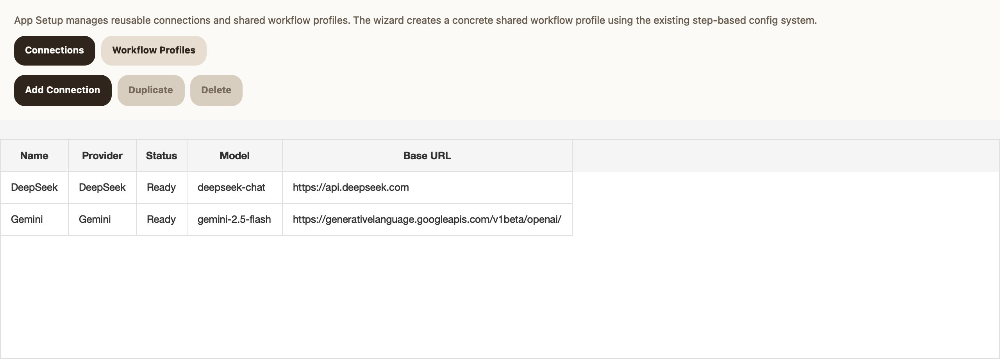
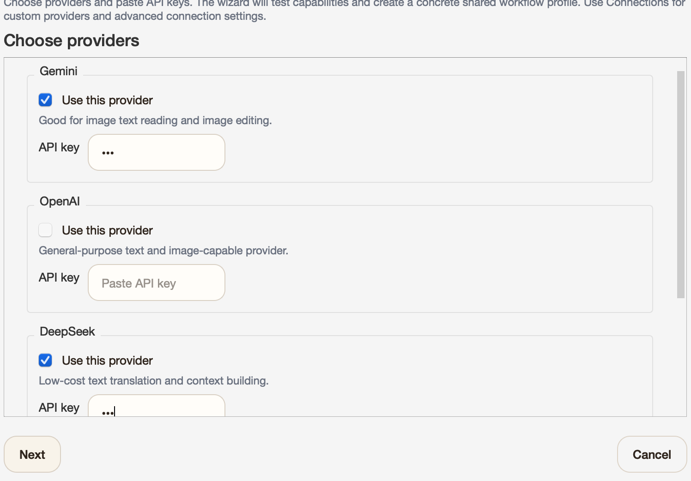
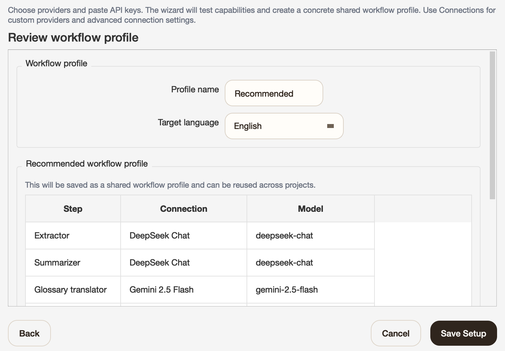
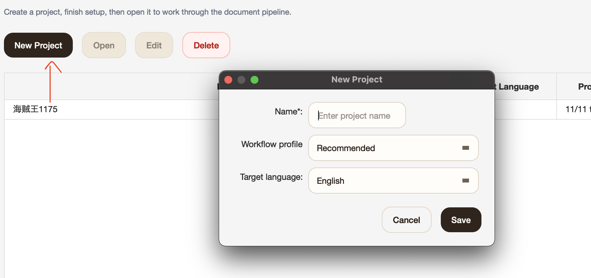
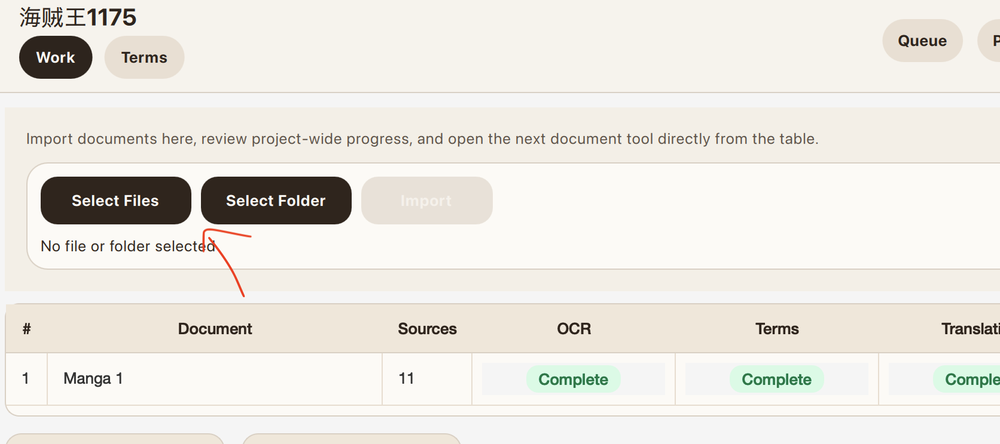
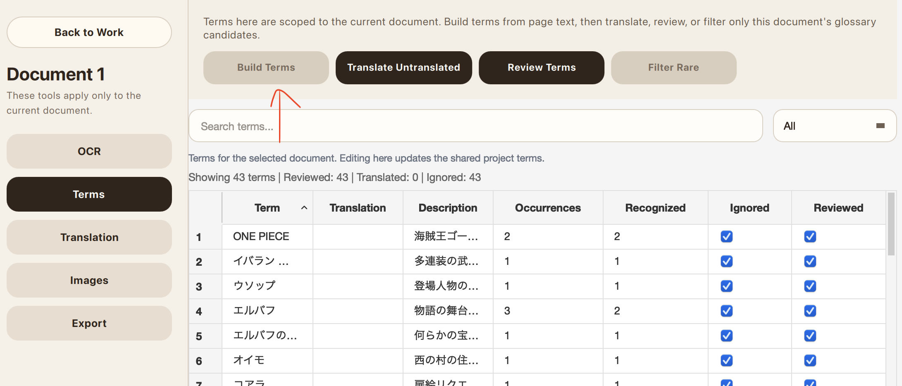
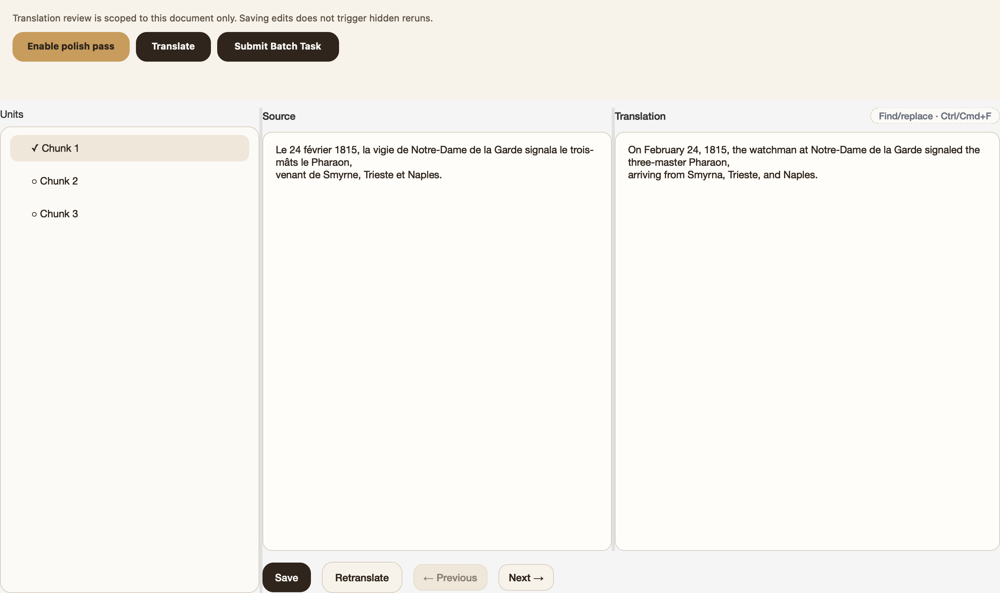
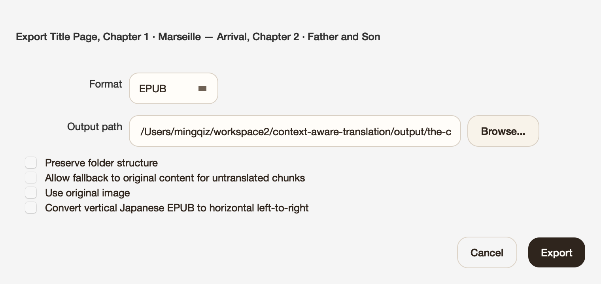

**English** | [中文](README_ZH.md)

# Context-Aware Translation (CAT)

CAT is a desktop app for translating long novels, books, PDFs, scanned documents, and manga while keeping names, terms, and context consistent.

## Who CAT Is For

- Novel, web novel, and light novel translation
- Long books and documents that need consistent naming and terminology
- Scanned books, PDFs, and manga that need OCR before translation
- People who want a desktop workflow instead of managing prompts by hand

## Why CAT

- Builds a glossary from your source material
- Carries context forward across chapters and pages
- Lets you review OCR and terms before export
- Handles text, EPUB, PDF, scanned pages, and manga in one app

## Install

Current desktop builds are unsigned, so the first launch may show an OS security warning.

### macOS

- Download the latest `.dmg`
- Open it and drag `CAT-UI.app` into `Applications`
- Launch `CAT-UI.app` from `Applications`
- If macOS blocks it because the developer cannot be verified, go to `System Settings` -> `Privacy & Security`
- In the `Security` section, click `Open Anyway` for `CAT-UI.app`, then confirm `Open`

### Windows

- Download the latest `.zip`
- Unzip it anywhere
- Run `CAT-UI.exe`
- If Windows SmartScreen warns that the app is unrecognized, click `More info` -> `Run anyway`

## Quick Start

### 1. Open App Settings and start setup

### 2. Run setup wizard

### 3. Choose providers and paste API keys. Gemini and DeepSeek are recommended and the only well-tested combination so far.

### 4. Choose the target language

### 5. Create a new project

### 6. Import files in reading order

### 7. Build, filter, review, and translate terms before translation if needed

### 8. Run translation

### 9. Export the result

## What To Know Before Using CAT

- The setup wizard is currently tested mainly with `DeepSeek` + `Gemini`.
- Other providers and models may work, but I do not have access to most of them, so they are not tested here. Expect to configure connections manually and tune settings yourself.
- Image editing is very expensive.
- OCR is best-effort, especially on dense or messy layouts. Review before export.
- Import in reading order if you want the glossary and context to build correctly.
- CAT is still under active development, so expect rough edges.

## Supported Formats

| Type | Import | Export | OCR needed before translation? |
| --- | --- | --- | --- |
| Text | `.txt`, `.md` | `txt` | No |
| PDF | `.pdf` | `epub`, `md` | Yes |
| Scanned book | image files or folders | `epub`, `md` | Yes |
| Manga | `.cbz`, image folders | `cbz` | Yes |
| EPUB | `.epub` | `epub`, `md`, `docx`, `html` | No, but image OCR is supported |
