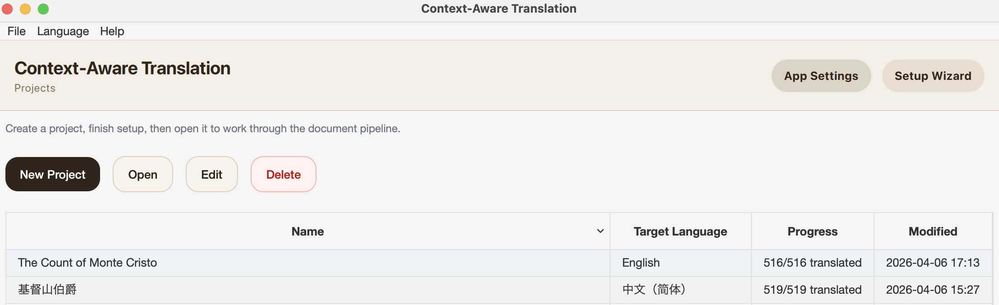
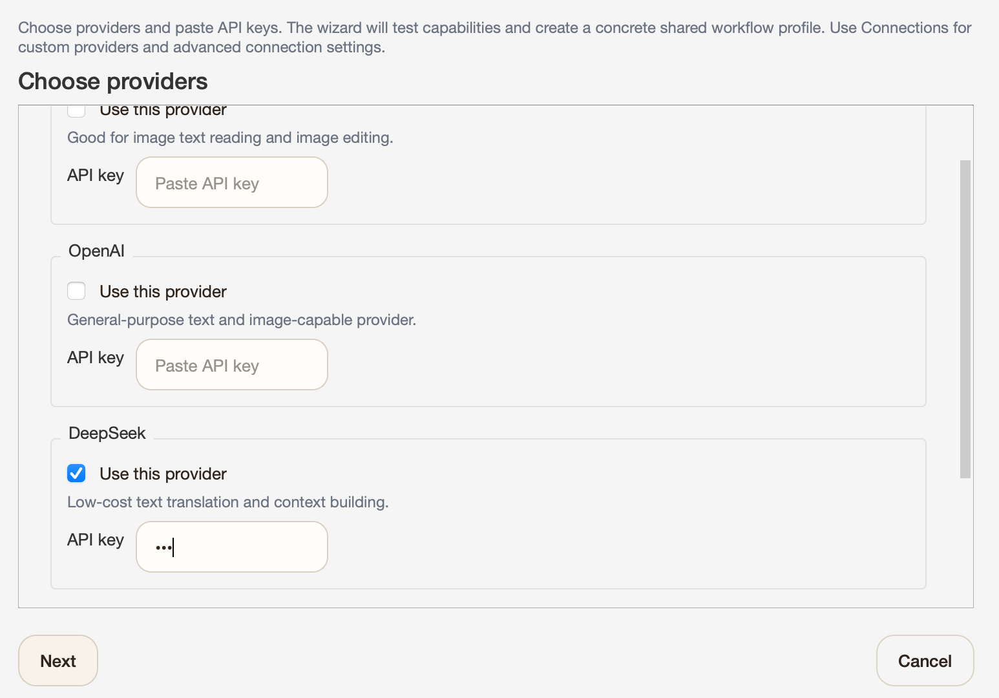
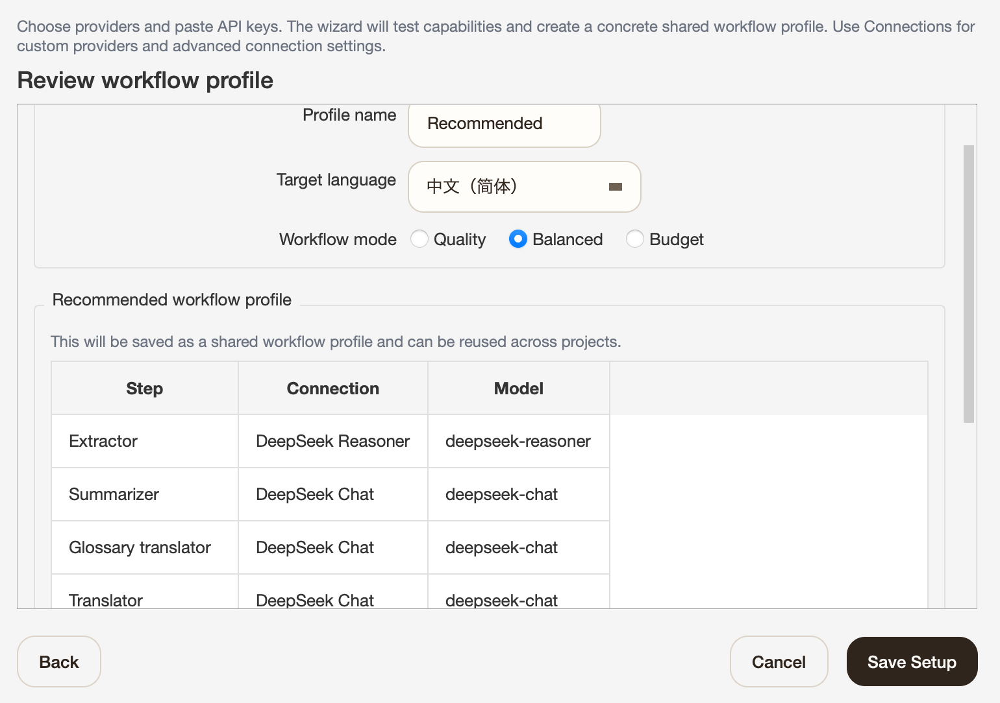
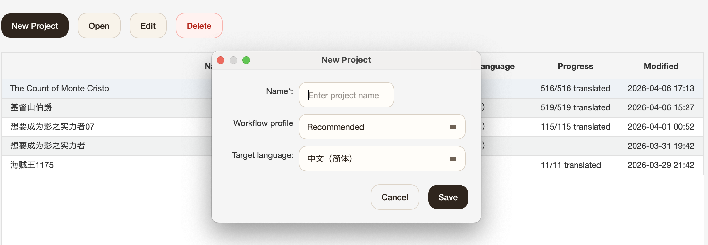
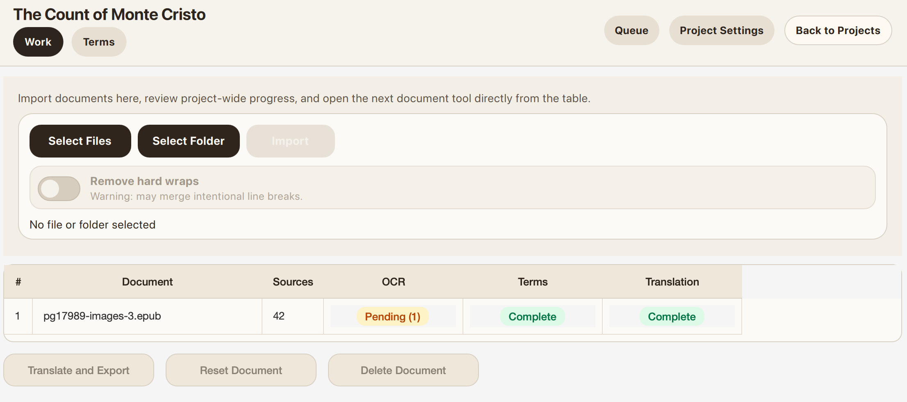
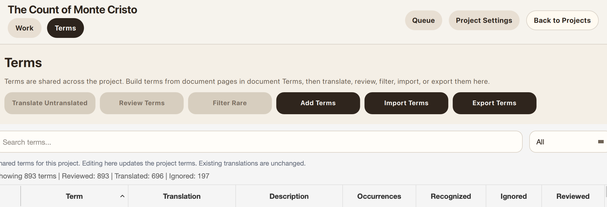

**English** | [中文](README_ZH.md)

# Context-Aware Translation (CAT)

CAT is a fully automatic desktop translation app for long novels, books, PDFs, scanned documents, manga, and subtitles. It aims to preserve source formatting while keeping terminology and translation style consistent across the whole work.

## Who CAT Is For

- Novel, web novel, and light novel translation
- Long books and documents that need consistent naming and terminology
- Scanned books, PDFs, and manga that need OCR before translation
- People who want a desktop workflow instead of managing prompts by hand

## Why CAT

- Builds a glossary from your source material
- Carries context forward across chapters and pages, with useful summaries injected alongside glossary context
- Preserves original formatting for text-native files
- Handles text, EPUB, PDF, scanned pages, manga, and subtitles in one app

## Install

Current desktop builds are unsigned, so the first launch may show an OS security warning.

### macOS

- Download the latest `.dmg`
- Open it and drag `CAT-UI.app` into `Applications`
- Launch `CAT-UI.app` from `Applications`
- If macOS blocks it because the developer cannot be verified, go to `System Settings` -> `Privacy & Security`
- In the `Security` section, click `Open Anyway` for `CAT-UI.app`, then confirm `Open`

### Windows

- Download the latest `.zip`
- Unzip it anywhere
- Run `CAT-UI.exe`
- If Windows SmartScreen warns that the app is unrecognized, click `More info` -> `Run anyway`

<strong>Setup</strong>

### 1. Open the projects screen and click `Setup Wizard`

This is the home screen for projects. Use `Setup Wizard` for the quickest first-time setup.

### 2. Choose providers and paste API keys

The wizard collects the providers it needs up front. For most users, `DeepSeek` + `Gemini` is the most practical starting point.

### 3. Review the workflow profile

The review step shows which connection and model CAT will use for each workflow step.

`Quality` spends more for better reasoning and can get very, very expensive unless you are using only `DeepSeek`. `Balanced` is the safest default. `Budget` is the cheapest option when you want to minimize cost.

## Translation

### 1. Create a project

Pick a project name, target language, and workflow profile.

### 2. Open the project work page

Import files in reading order so terminology and context stay consistent across the whole book, then click `Translate and Export` to start. Double-click a file if you want to inspect each step manually or retouch images.

### 3. Optional: import existing term translations

Open `Terms`, then use `Import Terms` if you already have a terminology list you want CAT to reuse. A simple JSON object like `{"original": "translated"}` is enough.

## Demo EPUBs

These two sample EPUBs were generated with `Translate and Export` directly from the French Project Gutenberg EPUB for [The Count of Monte Cristo, Tome I](https://www.gutenberg.org/ebooks/17989), using `DeepSeek`.

Quality can be dramatically better with `Gemini` or `GPT`, but the cost is also significantly higher.

- [The Count of Monte Cristo.epub](demo/The Count of Monte Cristo.epub) - English output. Cost: under `$2.5`.
- [基督山伯爵.epub](demo/基督山伯爵.epub) - Simplified Chinese output. Cost: under `$2.5`.

## What To Know Before Using CAT

- The setup wizard path is mainly tested with `DeepSeek` + `Gemini`. `Claude` and `GPT` should also work well, but I do not recommend going below `DeepSeek`-class models.
- Image editing is expensive, and hallucinations are still common.
- OCR does not preserve original layout for PDFs and scanned books. It rebuilds from content instead. Manga is the exception.
- Import in reading order if you want the glossary and context to build correctly.
- Samples are still limited because testing across formats is expensive. Bug reports are very welcome.

## Supported Formats

| Type | Import | Export | OCR needed before translation? |
| --- | --- | --- | --- |
| Text | `.txt`, `.md` | `txt` | No |
| PDF | `.pdf` | `epub`, `md` | Yes |
| Scanned book | image files or folders | `epub`, `md` | Yes |
| Manga | `.cbz`, image folders | `cbz` | Yes |
| EPUB | `.epub` | `epub`, `md`, `docx`, `html` | No, but image OCR is supported |
| Subtitle | `.srt`, `.vtt`, `.ass`, `.ssa` | `srt`, `vtt`, `ass`, `ssa` | No |
