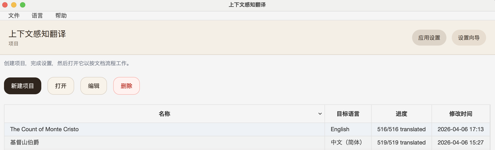
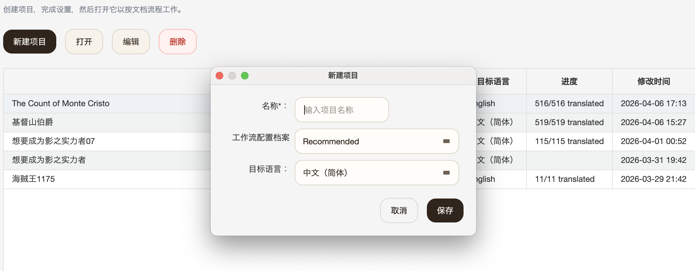
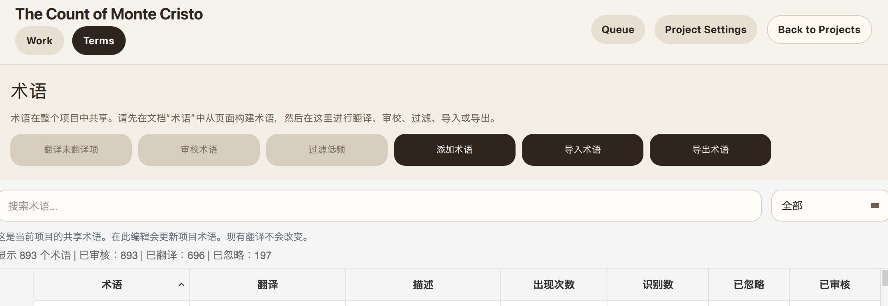

**中文** | [English](README.md)

# 上下文感知翻译（CAT）

CAT 是一个能完美保留原文格式，保证术语和翻译风格一致性的**全自动**桌面翻译工具，适合翻译长篇小说、书籍、PDF、扫描文档和漫画。

## 为什么用 CAT

- 可以从原文自动构建术语表
- 会随着章节和页数推进持续累积上下文，将会有助于翻译的信息总结并随术语表插入。
- 保证完美保留原文格式（需要OCR的pdf和扫图除外）。
- 文本、EPUB、PDF、扫描页、漫画可以用同一套流程处理

## 安装

当前桌面版构建没有签名，所以第一次启动时系统可能会弹出安全提示。

### macOS

- 下载最新的 `.dmg`
- 打开后把 `CAT-UI.app` 拖到 `Applications`
- 从 `Applications` 启动 `CAT-UI.app`
- 如果 macOS 因为开发者无法验证而阻止启动，打开 `系统设置` -> `隐私与安全性`
- 在 `安全性` 区域里为 `CAT-UI.app` 点击 `仍要打开`，然后再确认 `打开`

### Windows

- 下载最新的 `.zip`
- 解压到任意目录
- 运行 `CAT-UI.exe`
- 如果 Windows SmartScreen 提示应用无法识别，点击 `更多信息` -> `仍要运行`

<strong>设置</strong>

### 1. 打开项目首页，然后点击 `设置向导`

这里是项目首页。第一次使用时，直接点 `设置向导` 就行。

### 2. 选择服务商并填入 API key

向导会先收集需要的连接。对大多数用户来说，`DeepSeek` + `Gemini` 是最实用的起点。

### 3. 检查工作流配置档案

这个步骤会展示每个流程步骤实际会使用哪个连接和模型。

`质量优先` 会非常非常贵，除非你只用 `DeepSeek`。`均衡` 适合作为默认选择。`预算优先` 适合优先压低成本。

## 翻译

### 1. 新建项目

填写项目名、目标语言和工作流配置档案。

### 2. 打开项目工作页

按阅读顺序导入文件，这样术语和上下文才能在整本书里保持一致，然后点击翻译并导出开始翻译。双击文件如果你想手动审查每一步的结果或者修图。

### 3. 可选：导入现成术语翻译

打开 `术语` 页，如果你已经有术语表，就用 `导入术语` 直接导入。最简单的 JSON 形式就是 `{"original": "translated"}`。

## 示例 EPUB

下面两个示例 EPUB 都是直接从 Project Gutenberg 上的法语《基督山伯爵》第一卷 EPUB [17989](https://www.gutenberg.org/ebooks/17989) 用 `翻译并导出` 一键生成的。

- [The Count of Monte Cristo.epub](demo/The Count of Monte Cristo.epub) - 英文版，每本成本不到 `18 元人民币`。
- [基督山伯爵.epub](demo/基督山伯爵.epub) - 简体中文版，每本成本不到 `18 元人民币`。

## 使用前需要知道

- 目前主要测试过的是 `DeepSeek` + `Gemini` 的向导配置路径。但我相信claude/gpt效果只会更好。不建议使用比deepseek更差的模型。
- 图片编辑会很烧钱，而且幻觉普遍比较严重。
- OCR 不支持保留原排版，而是根据内容重新排版，漫画除外。
- 如果你希望术语和上下文持续累积，请按阅读顺序导入。
- 个人财力有限，能测试的样本有限。欢迎报告bug。

## 支持格式

| 类型 | 导入 | 导出 | 翻译前是否需要 OCR |
| --- | --- | --- | --- |
| 文本 | `.txt`, `.md` | `txt` | 否 |
| PDF | `.pdf` | `epub`, `md` | 是 |
| 扫描书籍 | 图片文件或文件夹 | `epub`, `md` | 是 |
| 漫画 | `.cbz`、图片文件夹 | `cbz` | 是 |
| EPUB | `.epub` | `epub`, `md`, `docx`, `html` | 否，但支持图片 OCR |
