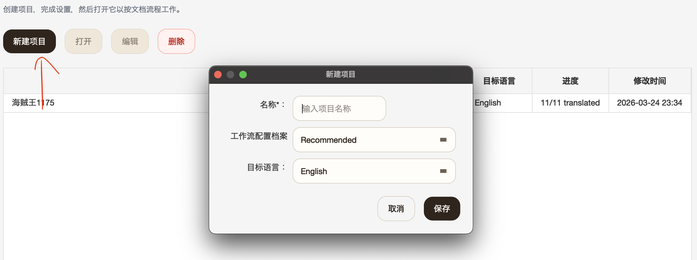
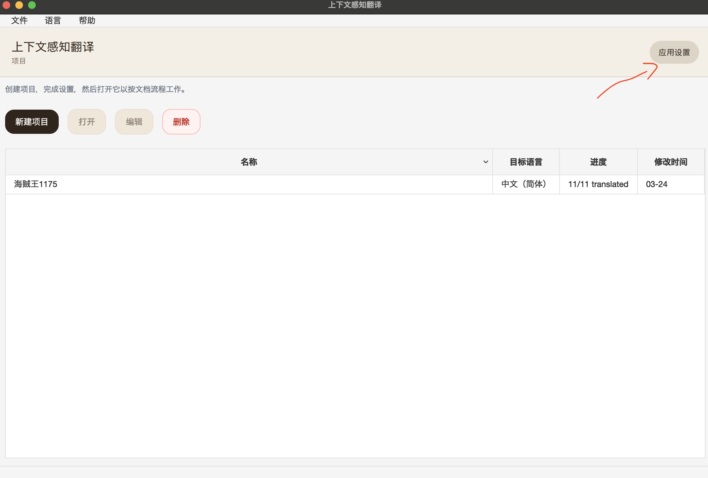
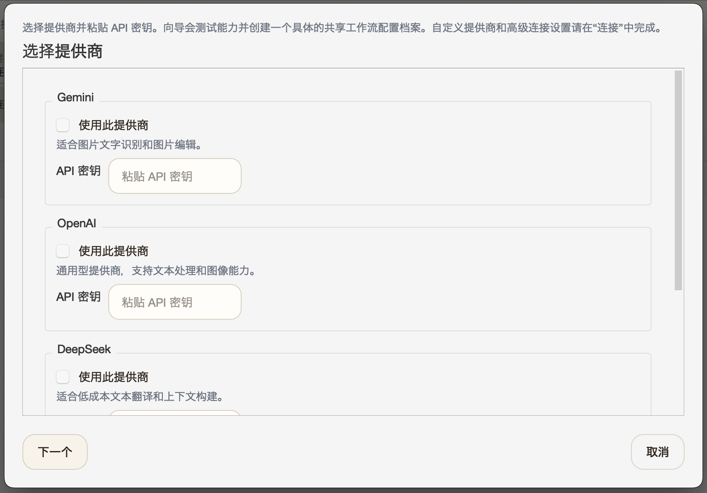
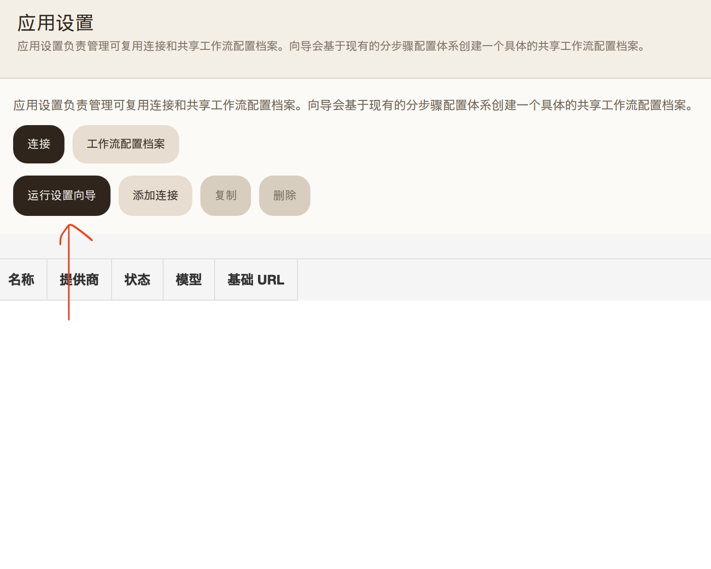
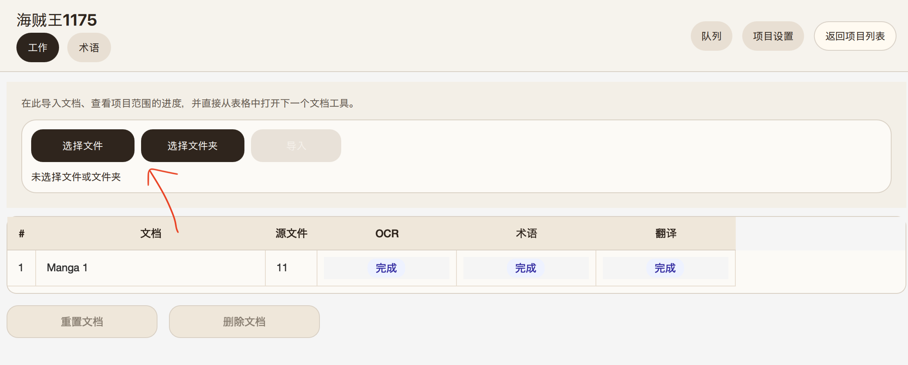
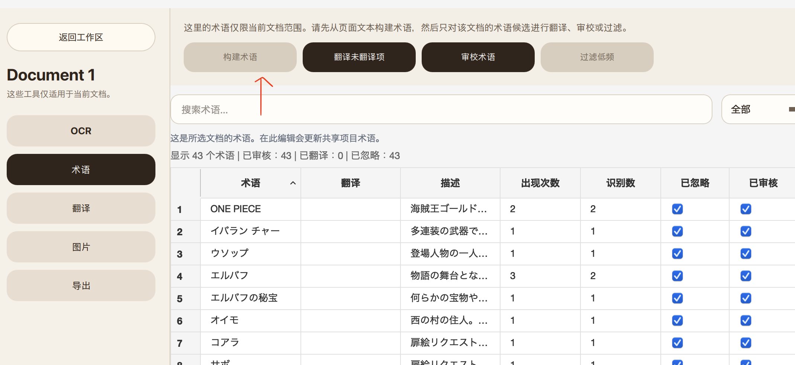
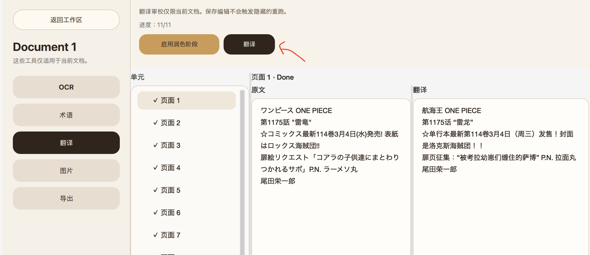
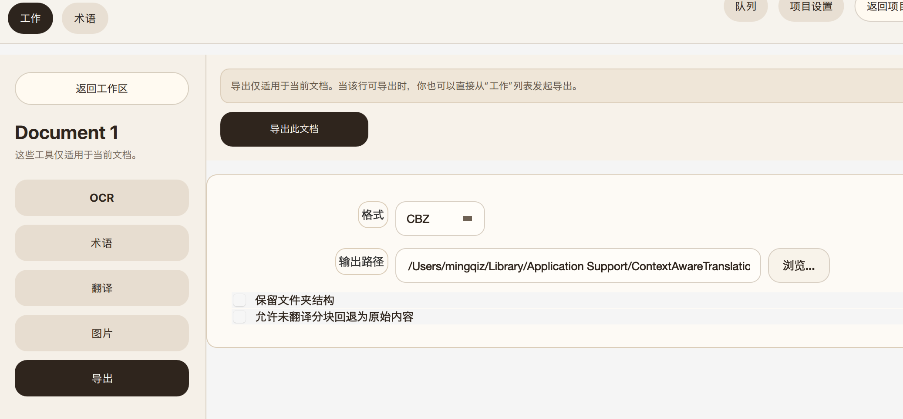

**中文** | [English](README.md)

# 上下文感知翻译（CAT）

CAT 是一个桌面翻译工具，适合翻译长篇小说、书籍、PDF、扫描文档和漫画，并尽量保持人名、术语和上下文一致。

## 适合谁用

- 翻译小说、网文、轻小说
- 翻译需要统一人名、地名、术语的长文档
- 翻译需要先 OCR 的扫描书、PDF 和漫画
- 不想手动拼 Prompt，希望直接用桌面工作流的人

## 为什么用 CAT

- 可以从原文自动构建术语表
- 会随着章节和页数推进持续累积上下文
- 可以先复核 OCR 和术语，再导出结果
- 文本、EPUB、PDF、扫描页、漫画可以用同一套流程处理

## 安装

### macOS

- 下载最新的 `.dmg`
- 打开后把 `CAT-UI.app` 拖到 `Applications`
- 从 `Applications` 启动 `CAT-UI.app`

### Windows

- 下载最新的 `.zip`
- 解压到任意目录
- 运行 `CAT-UI.exe`

### 本地构建（可选）

- macOS：`make build-macos-app`
- 其它平台：`make build-ui`

## 快速开始

1. 打开 CAT，进入 App Settings，然后运行 Setup Wizard。
2. 选择 `Gemini` 和 `DeepSeek`，填入 API key，选好目标语言，然后保存推荐工作流。
3. 按阅读顺序导入文件。
4. PDF、图片文件夹、漫画请先做 OCR。
5. 开始翻译。
6. 如果你想把译文重新写回漫画页或图片里，请先跑 Image reembedding（把文字写回图片）再导出。
7. 导出结果。

对大多数用户来说，向导生成的默认配置应该就够用了。

## 快速流程截图

### 1. 新建项目

### 2. 打开 App Settings，开始设置

### 3. 选择服务商并填入 API key

### 4. 选择目标语言并查看推荐工作流

### 5. 完成向导并保存设置

### 6. 按阅读顺序导入文件

### 7. 需要的话，先构建或检查术语

### 8. 开始翻译

### 9. 导出结果

## 使用前需要知道

- 目前主要测试过的是 `DeepSeek` + `Gemini` 的向导配置路径。
- 其它 provider 和 model 也可能能用，但我没有条件测试大多数模型，所以这里没有验证过。通常需要你自己手动配置连接并调整参数。
- Image reembedding（把文字写回图片）和图片编辑都会很烧钱。
- 漫画导出前，如果希望页面里直接带译文，需要先做 Image reembedding（把文字写回图片）。
- OCR 是尽力而为，复杂版面请先人工复核再导出。
- 如果你希望术语和上下文持续累积，请按阅读顺序导入。
- CAT 还在持续迭代，遇到一些粗糙之处是正常的。

## 支持格式

| 类型 | 导入 | 导出 | 翻译前是否需要 OCR |
| --- | --- | --- | --- |
| 文本 | `.txt`, `.md` | `txt` | 否 |
| PDF | `.pdf` | `epub`, `md` | 是 |
| 扫描书籍 | 图片文件或文件夹 | `epub`, `md` | 是 |
| 漫画 | `.cbz`、图片文件夹 | `cbz` | 是 |
| EPUB | `.epub` | `epub`, `md`, `docx`, `html` | 否，但支持图片 OCR |
