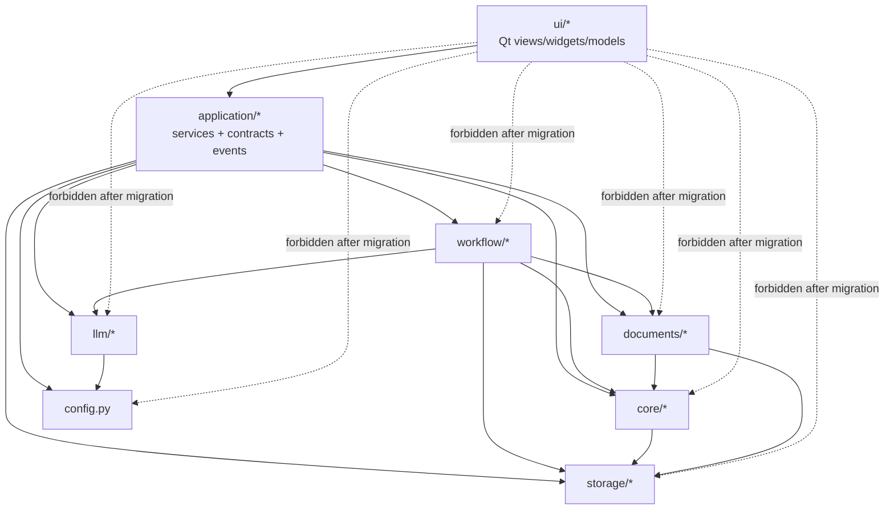

# ADR 0001: Application Boundary and UI Isolation

Status: Accepted
Date: 2026-03-08
Owners: Technical migration program
Related: [Task 00](tasks/00-foundation-boundaries.md)

## Decision Summary

The product will adopt a strict application boundary between UI and backend.

The end-state architecture is:
- UI depends only on `context_aware_translation.application`
- `application` owns commands, queries, DTOs, events, and errors
- backend internals (`workflow`, `storage`, `core`, `documents`, `llm`, `config`) stay behind that boundary
- Qt is treated as a desktop adapter, not the owner of business logic
- future React or web UI can talk to the same contract through another adapter without rewriting backend logic

This ADR is the source of truth for package ownership, import direction, and
migration rules.

## Context

The approved UX redesign changes the shell and setup model substantially:
- app shell: `Projects`, `App Setup`
- project shell: `Work`, `Terms`, `Setup`
- document workspace: `Overview`, `OCR`, `Terms`, `Translation`, `Images`, `Export`
- `Queue` remains a secondary utility surface

The current code does not have a stable boundary that can support that redesign
cleanly.

Current coupling problems include:
- [main_window.py](/Users/mingqiz/.codex/worktrees/f999/context-aware-translation/context_aware_translation/ui/main_window.py) constructs `BookManager`, `TaskStore`, `WorkerDeps`, `WorkflowSession`, and registers task handlers directly.
- [book_workspace.py](/Users/mingqiz/.codex/worktrees/f999/context-aware-translation/context_aware_translation/ui/views/book_workspace.py) owns tab construction and injects backend internals into feature views.
- views such as [translation_view.py](/Users/mingqiz/.codex/worktrees/f999/context-aware-translation/context_aware_translation/ui/views/translation_view.py), [glossary_view.py](/Users/mingqiz/.codex/worktrees/f999/context-aware-translation/context_aware_translation/ui/views/glossary_view.py), and [ocr_review_view.py](/Users/mingqiz/.codex/worktrees/f999/context-aware-translation/context_aware_translation/ui/views/ocr_review_view.py) open SQLite-backed repositories and task-engine APIs directly.
- Qt-specific signals are currently the effective event model.

That structure makes two things hard:
1. replacing the UI stack later
2. parallelizing feature work now

## Decision

### 1. Introduce an `application` layer

A new package is introduced:

```text
context_aware_translation/
  application/
    contracts/
    services/
    events.py
    errors.py
    composition.py
```

Responsibilities:
- define stable command/query contracts
- define typed DTOs returned to UI
- define typed application events
- wrap backend orchestration and persistence behind service interfaces
- provide a single composition root for desktop and future transport adapters

### 2. Use Pydantic v2 for application contracts

Application contracts will use Pydantic v2 models.

This applies to:
- request/command payloads
- query results / view models
- event payloads
- public application-layer error payloads when serialized

Reasons:
- explicit validation at the UI/backend boundary
- deterministic JSON serialization via `model_dump()` / `model_dump_json()`
- easier future HTTP/JSON transport without redefining models
- clearer schema evolution than ad hoc dicts
- the project already ships with `pydantic` available

What does **not** change:
- internal backend dataclasses remain valid and should stay where they already work well
- `workflow`, `storage`, `core`, and `documents` do not need to be converted wholesale

Rule:
- Pydantic is for application contracts
- existing dataclasses remain acceptable for backend internals

### 3. Service interfaces live in `application.services`

Each top-level UX surface gets an application service boundary.

Expected service areas:
- `ProjectsService`
- `AppSetupService`
- `ProjectSetupService`
- `WorkService`
- `TermsService`
- `DocumentService`
- `QueueService`

These services own:
- commands
- queries
- orchestration of existing backend pieces
- mapping backend internals into application DTOs

UI code must not reconstruct workflow or persistence objects itself.

### 4. Surface queries own action state

Application queries must return enough state for the UI to render buttons,
toolbar actions, and blockers without calling backend internals directly.

This includes:
- whether an action is enabled
- whether an action is currently busy
- why an action is blocked
- where the user should be routed to resolve the blocker

Rules:
- migrated UI must not call `TaskEngine.preflight()` directly
- migrated UI must not call `has_active_claims()` directly
- migrated UI must not reconstruct claim checks from raw task state
- view code renders backend-provided action state and blocker info only

This does **not** remove strict backend preflight.

Render-time action state is advisory.
Command execution must still perform authoritative preflight in the application
service or backend task path, because claims can change between render and click.

### 5. Events live in `application.events`

`application.events` is the canonical location for:
- typed event base classes or discriminated unions
- publisher/subscriber protocols
- application-level event names and payloads

Expected event families:
- project events
- setup events
- queue/task events
- document events
- terms events

Rules:
- event types must be UI-framework-agnostic
- events may reference DTOs from `application.contracts`
- Qt signals are an adapter mechanism, not the canonical event model
- events should primarily be invalidation events, not raw task-engine mirrors

Recommended invalidation families:
- `QueueChanged(project_id)`
- `WorkboardInvalidated(project_id)`
- `DocumentInvalidated(project_id, document_id, sections)`
- `TermsInvalidated(project_id, document_id | None)`
- `SetupInvalidated(project_id | None)`

### 6. Refresh uses invalidation + requery

Migrated UI surfaces should refresh by:
1. receiving an application invalidation event
2. re-running the relevant application query
3. rerendering from fresh DTOs

This replaces widget-local listener logic that currently mixes:
- DB reads
- task-engine signals
- direct claim checks
- ad hoc button enabling/disabling

Important constraint:
- invalidation must cover both persisted DB state changes and in-memory active
  claim changes

Reason:
- current claim conflict state lives partly in memory in the task engine
- DB-only refresh is not sufficient for correct button state

### 7. Composition lives in `application.composition`

`application.composition` becomes the single composition root for the desktop app.

It is responsible for constructing and wiring:
- `BookManager`
- registry access
- task store
- engine/task orchestration adapters
- workflow session factories
- application service implementations
- application event publisher/subscriber wiring

Rules:
- UI code must not instantiate `BookManager`, `TaskStore`, or `WorkerDeps`
- UI code must not know how `WorkflowSession` is created
- future HTTP transport must be able to reuse the same composition root

### 8. `BookManager` remains infrastructure-internal

`BookManager` stays in `storage/` and remains part of backend infrastructure.

Decision:
- do not expose `BookManager` directly to UI after a slice is migrated
- application services may use it internally
- migrated UI surfaces receive service interfaces or service-backed controllers only

Reason:
- `BookManager` mixes persistence, registry access, default seeding, and config/book lifecycle concerns
- it is not a stable UI contract

### 9. `TaskEngine` is wrapped, not exposed as the UI contract

`TaskEngine` currently mixes:
- Qt signal emission
- task mutation APIs
- direct exposure of `TaskRecord`-shaped data

Decision:
- `TaskEngine` is not the long-term UI contract
- application services and `QueueService` will be the UI-facing task/queue contract
- Qt-specific task notifications must be translated from application events

Pragmatic migration rule:
- during migration, application services may adapt the existing `TaskEngine` or `EngineCore`
- new feature UIs must not receive `TaskEngine` directly in their constructor once migrated

This allows gradual migration without forcing an immediate rewrite of task execution.

## Target Package Ownership

### UI-only

Belongs in `ui/`:
- Qt widgets, dialogs, views, models, translations, styles
- Qt signal/slot glue
- view-local presentation state
- adapter code that converts application events to Qt updates

### Application layer

Belongs in `application/`:
- service interfaces and implementations
- request/response contracts
- application-level errors
- event definitions
- composition root
- backend-to-contract mapping logic

### Backend-internal

Stay outside UI and application contracts:
- `workflow/`
- `storage/`
- `core/`
- `documents/`
- `llm/`
- `config.py`

These remain free to change internally as long as application contracts stay stable.

## Dependency Diagram



## Import Direction Rules

These are fixed rules, not suggestions.

### Rule A: Migrated UI slices

A migrated UI module may import only:
- `context_aware_translation.application.*`
- `context_aware_translation.ui.*`
- standard library
- approved third-party UI libraries

A migrated UI module must not import:
- `context_aware_translation.storage.*`
- `context_aware_translation.workflow.*`
- `context_aware_translation.core.*`
- `context_aware_translation.documents.*`
- `context_aware_translation.llm.*`
- `context_aware_translation.config`

### Rule B: Application layer

`application/*` may import:
- `workflow/*`
- `storage/*`
- `core/*`
- `documents/*`
- `llm/*`
- `config.py`
- standard library
- third-party validation/typing libs

`application/*` must not import:
- `ui/*`

### Rule C: Backend internals

Backend internal packages must not import:
- `ui/*`
- `application/*` except where a very narrow adapter is explicitly introduced and documented later

The default rule is: backend knows nothing about UI or application.

### Rule D: Contracts

`application.contracts.*` must contain:
- serializable models only
- no Qt types
- no raw SQLite rows
- no ORM-ish repository objects
- no backend task-engine record types

### Rule E: Events

`application.events` must contain:
- transport-agnostic event types
- no Qt `Signal`
- no QObject inheritance

## Migration Note: Qt Becomes an Adapter

### Current state

Qt currently owns too much:
- app bootstrap
- task-engine setup
- service construction
- backend object lifetime
- event semantics

### Target state

Qt should own only:
- rendering
- user interaction
- local presentation state
- adapting application events into Qt signals and widget refreshes

That means:
- `MainWindow` should request a composed application container, not build one
- views should receive application services or thin feature controllers backed by those services
- queue/status widgets should bind to application event streams, not raw task-engine records

### What stays desktop-specific

Desktop-specific concerns remain in Qt adapters, for example:
- tray behavior
- window geometry persistence
- native file dialogs
- desktop notifications
- sleep inhibition

These do not belong in application services.

## Future Non-Python UI Strategy

This ADR deliberately does **not** introduce HTTP transport now.

However, the boundary is designed so that a future React or web UI can be added by:
1. reusing `application.contracts` as canonical request/response shapes
2. exposing application services through an HTTP or IPC adapter
3. exposing `application.events` through polling, SSE, or WebSocket transport

Because contracts are Pydantic models and events are framework-agnostic, the
same application layer can serve:
- in-process Qt UI now
- an out-of-process web UI later

## Consequences

### Benefits

- UI/backend coupling becomes explicit and enforceable
- feature slices can be assigned in parallel with less file contention
- backend refactors can proceed behind stable contracts
- future UI-stack replacement becomes realistic

### Costs

- additional mapping code from backend internals to application DTOs
- a temporary coexistence period where old Qt views and new service-backed views both exist
- more up-front discipline around package boundaries

### Accepted tradeoff

This is not a small refactor. It is the cost of making the codebase scalable for
parallel work and future UI replacement.

## Non-Goals

This ADR does not:
- redesign the UX
- introduce microservices
- require immediate HTTP transport
- rewrite workflow execution logic
- rewrite storage internals

## Immediate Follow-On Work

This ADR unblocks the next tasks in order:
1. [Task 01](tasks/01-foundation-contracts.md)
2. [Task 02](tasks/02-foundation-services-composition.md)
3. [Task 03](tasks/03-foundation-events-queue-contract.md)
4. [Task 04](tasks/04-foundation-tests-and-boundaries.md)

## Enforcement Plan

This ADR is only useful if later tasks enforce it.

Planned enforcement:
- import-boundary checks in CI
- fake application services for migrated UI tests
- service-interface-first constructors for migrated screens
- no new direct `BookManager` / repository injections into migrated views
